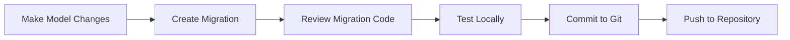

# Database Migration Strategy

This document outlines the strategy for managing database migrations in the AktieKoll application across different environments.

## Table of Contents

- [Overview](#overview)
- [Current Migrations](#current-migrations)
- [Migration Workflow](#migration-workflow)
- [Running Migrations](#running-migrations)
- [Rollback Strategy](#rollback-strategy)
- [Backup and Restore](#backup-and-restore)
- [Production Deployment](#production-deployment)
- [Troubleshooting](#troubleshooting)
- [Best Practices](#best-practices)

## Overview

AktieKoll uses **Entity Framework Core Migrations** to manage database schema changes. Migrations are code-first, version-controlled, and can be applied or rolled back as needed.

### Key Principles

1. **Always backup before migrations** - Especially in production
2. **Test migrations locally** - Before deploying to production
3. **Never modify existing migrations** - Create new ones instead
4. **Migrations are forward-only** - Rollbacks should be rare
5. **Keep migrations small** - One logical change per migration

## Current Migrations

The application has the following migrations (in chronological order):

| Migration | Date | Description |
|-----------|------|-------------|
| `20250612210410_Refactor-db` | 2025-06-12 | Initial database refactor |
| `20250612212303_Update publishingDate and drop old date` | 2025-06-12 | Updated date handling |
| `20251016165310_Symbol` | 2025-10-16 | Added Symbol and Isin columns |

### Current Schema

The main table is `InsiderTrades` with columns:
- Identity fields
- Company information
- Person details (name, position)
- Transaction details (type, quantity, price)
- Dates (transaction, publishing)
- Symbol and ISIN identifiers

## Migration Workflow

### Development Workflow



### Creating New Migrations

```bash
# Navigate to project directory
cd src/AktieKoll

# Create a new migration
dotnet ef migrations add MigrationName

# Review the generated files
# - XXXXXX_MigrationName.cs (Up/Down methods)
# - XXXXXX_MigrationName.Designer.cs (metadata)
# - ApplicationDbContextModelSnapshot.cs (current schema)

# Test the migration
dotnet ef database update

# Verify the changes
dotnet ef migrations list
```

### Naming Conventions

Use descriptive names that explain what the migration does:

**Good names:**
- `AddUserEmailIndex`
- `RenameCompanyToOrganization`
- `AddTransactionStatusColumn`

**Bad names:**
- `Update1`
- `FixStuff`
- `Changes`

## Running Migrations

### Local Development

```bash
# Option 1: Using EF Core CLI
cd src/AktieKoll
dotnet ef database update

# Option 2: Using the migration script
./scripts/migrate.sh local

# Option 3: Automatically on startup (not recommended)
# Can be configured in Program.cs but disabled by default
```

### Docker Environment

```bash
# After starting containers
docker-compose up -d

# Run migrations in the API container
docker-compose exec api dotnet ef database update

# Or use the migration script
./scripts/migrate.sh docker

# Check migration status
docker-compose exec api dotnet ef migrations list
```

### Production Environment

**IMPORTANT: Always backup before running migrations in production!**

```bash
# 1. Backup the database first
./scripts/backup-database.sh production

# 2. Run migrations
./scripts/migrate.sh production

# 3. Verify migrations applied
./scripts/check-migrations.sh production

# 4. Test the application
curl https://api.yourdomain.com/health/ready
```

## Rollback Strategy

### Understanding Rollbacks

EF Core migrations support rollback through the `Down()` method in each migration. However, **rollbacks should be a last resort** as they can cause data loss.

### When to Rollback

- Migration causes critical production issues
- Data integrity problems detected
- Schema change breaks the application

### When NOT to Rollback

- Minor bugs (fix with code deploy instead)
- Non-critical issues
- If rollback would cause data loss

### How to Rollback

```bash
# List all migrations
dotnet ef migrations list

# Rollback to a specific migration
dotnet ef database update PreviousMigrationName

# Example: Rollback the Symbol migration
dotnet ef database update "Update publishingDate and drop old date"

# Rollback all migrations (start from scratch)
dotnet ef database update 0
```

### Production Rollback Procedure

1. **Assess the situation** - Is rollback necessary?
2. **Take a backup** - Even before rollback
3. **Notify stakeholders** - Application may have downtime
4. **Stop the application** - Prevent data inconsistency
5. **Rollback the migration**:
   ```bash
   docker-compose exec api dotnet ef database update PreviousMigration
   ```
6. **Deploy previous application version** - Old code with old schema
7. **Verify application works** - Test critical functionality
8. **Resume normal operations**

### Rollback Alternatives

Instead of rolling back, consider:

1. **Hotfix migration** - Create a new migration to fix the issue
2. **Data migration** - Fix data issues without schema changes
3. **Feature flag** - Disable new features temporarily
4. **Code rollback only** - Revert code, leave schema (if compatible)

## Backup and Restore

### Automated Backup Before Migration

The migration scripts automatically create backups:

```bash
# Backup is created at: ./backups/aktiekoll_YYYY-MM-DD_HH-MM-SS.sql
```

### Manual Backup

```bash
# Using the backup script
./scripts/backup-database.sh [environment]

# Manual backup (local)
pg_dump -U postgres aktiekoll > backup.sql

# Manual backup (Docker)
docker-compose exec postgres pg_dump -U aktiekoll_user aktiekoll > backup.sql

# Compressed backup
docker-compose exec postgres pg_dump -U aktiekoll_user aktiekoll | gzip > backup.sql.gz
```

### Restore from Backup

```bash
# Using the restore script
./scripts/restore-database.sh [environment] backup.sql

# Manual restore (local)
psql -U postgres aktiekoll < backup.sql

# Manual restore (Docker)
cat backup.sql | docker-compose exec -T postgres psql -U aktiekoll_user aktiekoll

# From compressed backup
gunzip -c backup.sql.gz | docker-compose exec -T postgres psql -U aktiekoll_user aktiekoll
```

### Backup Best Practices

1. **Before every production migration** - Automatic in scripts
2. **Daily scheduled backups** - Set up cron job
3. **Store backups off-server** - Cloud storage (S3, Azure Blob)
4. **Test restores regularly** - Ensure backups work
5. **Keep multiple versions** - Last 7 days + monthly archives

## Production Deployment

### Pre-Deployment Checklist

- [ ] All tests passing in CI
- [ ] Migration tested in staging environment
- [ ] Database backup created
- [ ] Rollback plan documented
- [ ] Stakeholders notified
- [ ] Maintenance window scheduled (if needed)

### Zero-Downtime Migration Strategy

For migrations that can run while the application is running:

1. **Deploy new code** (compatible with old schema)
2. **Run migrations** (adds new columns/tables)
3. **Verify health checks**
4. **Deploy final code** (uses new schema)

For breaking changes:

1. **Enable maintenance mode**
2. **Backup database**
3. **Run migrations**
4. **Deploy new code**
5. **Verify application**
6. **Disable maintenance mode**

### Deployment Process

#### Option 1: Manual Deployment

```bash
# 1. Connect to production server
ssh user@production-server

# 2. Navigate to application directory
cd /opt/aktiekoll

# 3. Pull latest code
git pull origin main

# 4. Backup database
./scripts/backup-database.sh production

# 5. Run migrations
./scripts/migrate.sh production

# 6. Restart application
docker-compose up -d --build

# 7. Verify deployment
curl https://api.yourdomain.com/health/ready

# 8. Check logs
docker-compose logs -f api
```

#### Option 2: CI/CD Automated Deployment

The GitHub Actions workflow can be configured to run migrations:

```yaml
# Example: .github/workflows/deploy.yml
- name: Run Database Migrations
  run: |
    docker-compose exec -T api dotnet ef database update
```

#### Option 3: Kubernetes Init Container

For Kubernetes deployments, use an init container:

```yaml
initContainers:
- name: migration
  image: aktiekoll-api:latest
  command: ["dotnet", "ef", "database", "update"]
  env:
  - name: ConnectionStrings__PostgresConnection
    valueFrom:
      secretKeyRef:
        name: db-secret
        key: connection-string
```

### Post-Deployment Verification

```bash
# Check migration status
docker-compose exec api dotnet ef migrations list

# Verify database schema
docker-compose exec postgres psql -U aktiekoll_user aktiekoll -c "\dt"

# Check application health
curl https://api.yourdomain.com/health/ready

# Verify API endpoints
curl -H "X-API-Key: your-key" https://api.yourdomain.com/api/InsiderTrades

# Check logs for errors
docker-compose logs --tail=100 api | grep -i error
```

## Troubleshooting

### Migration Failed

**Symptom:** Migration fails with error message

**Solutions:**

1. Check database connectivity
   ```bash
   docker-compose exec postgres psql -U aktiekoll_user -d aktiekoll -c "SELECT 1;"
   ```

2. Check for schema conflicts
   ```bash
   docker-compose exec api dotnet ef migrations list
   ```

3. Check logs
   ```bash
   docker-compose logs api
   ```

4. Manually inspect database
   ```bash
   docker-compose exec postgres psql -U aktiekoll_user aktiekoll
   \dt  # List tables
   \d InsiderTrades  # Describe table
   ```

### Migration Already Applied

**Symptom:** "Migration 'XXX' has already been applied"

**Solution:** This is normal - EF Core tracks applied migrations in `__EFMigrationsHistory` table

```bash
# View migration history
docker-compose exec postgres psql -U aktiekoll_user aktiekoll \
  -c "SELECT * FROM \"__EFMigrationsHistory\" ORDER BY \"MigrationId\";"
```

### Pending Migrations

**Symptom:** Application won't start due to pending migrations

**Solution:** Run migrations

```bash
docker-compose exec api dotnet ef database update
```

### Migration Conflicts

**Symptom:** Merge conflict in migration files

**Solution:**

1. Never modify existing migrations
2. Reset your migrations:
   ```bash
   # Delete conflicting migration
   dotnet ef migrations remove

   # Pull latest from main
   git pull origin main

   # Create new migration
   dotnet ef migrations add YourMigration
   ```

### Connection Timeout

**Symptom:** "Timeout expired" during migration

**Solutions:**

1. Check PostgreSQL is running
2. Increase command timeout in connection string:
   ```
   Host=localhost;Database=aktiekoll;Username=user;Password=pass;Command Timeout=300
   ```
3. Check for long-running queries:
   ```sql
   SELECT * FROM pg_stat_activity WHERE state = 'active';
   ```

### Permission Denied

**Symptom:** "permission denied for table" or "must be owner"

**Solution:** Ensure database user has correct permissions

```sql
GRANT ALL PRIVILEGES ON DATABASE aktiekoll TO aktiekoll_user;
GRANT ALL PRIVILEGES ON ALL TABLES IN SCHEMA public TO aktiekoll_user;
```

## Best Practices

### Development

1. **Test migrations locally** before pushing
2. **Review generated SQL** before applying
3. **Keep migrations small** - one logical change
4. **Name migrations descriptively**
5. **Never modify existing migrations** after they're merged

### Production

1. **Always backup first** - No exceptions
2. **Test in staging** - Mirror production environment
3. **Schedule maintenance windows** for breaking changes
4. **Monitor after deployment** - Watch logs and metrics
5. **Have a rollback plan** - Document before deploying
6. **Communicate with team** - Notify about migrations

### Schema Design

1. **Add columns as nullable first** - Then populate and make required
2. **Use default values** - For new non-nullable columns
3. **Create indexes separately** - Use `CONCURRENTLY` in SQL
4. **Avoid renaming** - Drop and add instead (with data migration)
5. **Plan for rollback** - Ensure `Down()` methods work

### Data Migrations

For complex data migrations, use a separate script:

```csharp
// Example: Seed data migration
public partial class SeedInitialData : Migration
{
    protected override void Up(MigrationBuilder migrationBuilder)
    {
        migrationBuilder.Sql(@"
            INSERT INTO Companies (Name, Symbol)
            VALUES ('Example Corp', 'EX')
            ON CONFLICT DO NOTHING;
        ");
    }

    protected override void Down(MigrationBuilder migrationBuilder)
    {
        migrationBuilder.Sql(@"
            DELETE FROM Companies WHERE Symbol = 'EX';
        ");
    }
}
```

### Migration Review Checklist

Before merging a migration PR:

- [ ] Migration has descriptive name
- [ ] `Up()` method is correct
- [ ] `Down()` method works (tested)
- [ ] No data loss on rollback (or documented)
- [ ] Tested locally
- [ ] Reviewed generated SQL
- [ ] No breaking changes (or planned)
- [ ] Documentation updated

## Additional Resources

- [EF Core Migrations Docs](https://learn.microsoft.com/en-us/ef/core/managing-schemas/migrations/)
- [PostgreSQL Backup and Restore](https://www.postgresql.org/docs/current/backup.html)
- See `scripts/` directory for helper scripts
- See `DEPLOYMENT_CHECKLIST.md` for full deployment checklist

## Support

For migration issues:
1. Check logs: `docker-compose logs api`
2. Review this document
3. Check EF Core documentation
4. Open an issue on GitHub
